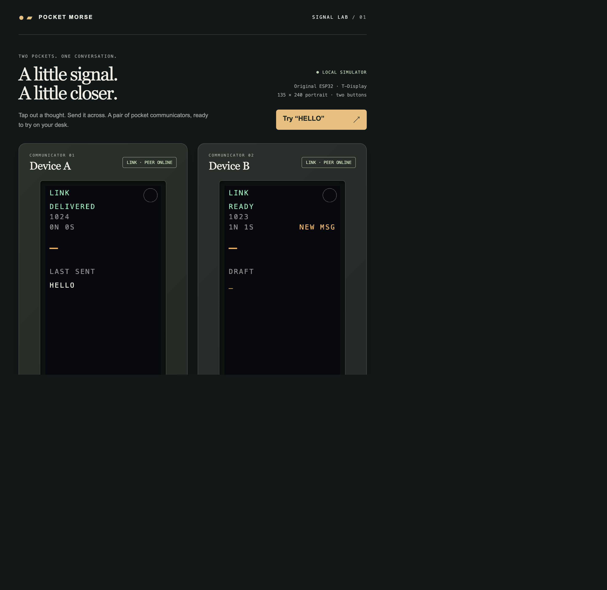
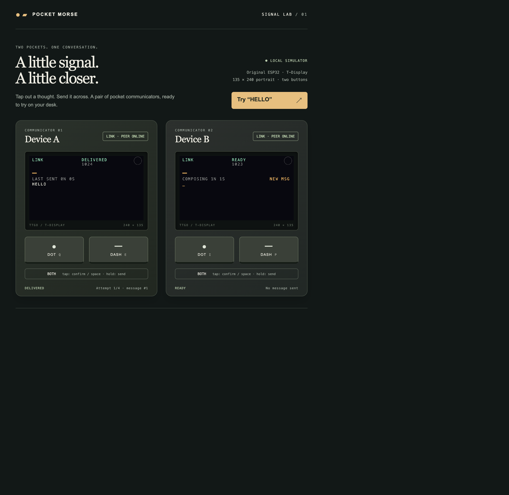

# Pocket Morse Communicators

An open-source project for building a pair of pocket Morse communicators with the **original LILYGO TTGO T-Display ESP32** (135 × 240 ST7789 display, two onboard buttons). The devices exchange authenticated, encrypted messages directly over ESP-NOW; no router, external buttons, LED, or buzzer is needed.

> This project targets the original TTGO T-Display, not the T-Display S3 or other similarly named boards. The browser lab is a simulator, not a radio or flash-storage emulator.

> **Hardware qualification:** automated tests and the `device_a` firmware build pass, but this revision has not been verified on physical paired devices. In particular, test DASH deep-sleep wake and ESP-NOW reconnection on your boards before relying on them. This project is not for emergency, safety-critical, or high-stakes communication.

## Demo

The screenshots show Device A delivering `HELLO` and Device B receiving a new inbox message in the browser simulator. They use the same C++ application core as the firmware.





## Parts and tools

- Two original LILYGO TTGO T-Display ESP32 boards. Confirm the display and flash size before building.
- USB data cables for flashing and one-time pairing.
- [PlatformIO Core](https://platformio.org/install/cli) for firmware builds.
- Python 3.10+ with Tkinter for the desktop flash-and-pair utility.
- Node.js and [Emscripten](https://emscripten.org/docs/getting_started/downloads.html) for the browser simulator and tests; `em++` must be on `PATH` to rebuild WebAssembly (tested with Emscripten 4.0.23).

## Flash and pair with the desktop utility

Download the latest Windows or macOS archive from the [GitHub Releases page](https://github.com/pilafdob/ESP32-Pocket-Morse/releases). Releases may be marked as prereleases while features are being tested. Extract the complete archive and run `PocketMorseUploader.exe` on Windows or open `PocketMorseUploader.app` on macOS. Keep `provision_pair` and the `project` folder beside the app; the archive is a unit. Unsigned builds may trigger the operating system's download warning.

The desktop app needs PlatformIO Core installed and its `pio` command available on `PATH`. It builds firmware locally for the selected board; the release archive includes the firmware source. Pairing uses the included helper and bundled pyserial. Release assets are built on native Windows/macOS runners and attached when a version tag matching `uploader-v*` is pushed. Local release packages are written to `build/mac-uploader/release/` by default; use `--output` to choose another location. See the [v1.0.0 release notes](docs/releases/uploader-v1.0.0.md) for changes and test status.

To build the desktop app yourself, install packaging dependencies and run the PyInstaller commands from the workflow in `.github/workflows/uploader-release.yml`; the workflow builds each operating system's native app on its own runner.

Create a Python environment and install the uploader dependencies (pyserial and PlatformIO):

```sh
python3 -m venv .venv
.venv/bin/python -m pip install -r requirements-uploader.txt
.venv/bin/python scripts/flash_pair_gui.py
```

The window lists connected serial devices. Plug in one board, select its port, choose role A or B, confirm its flash size, then select **Build & upload firmware**. Repeat for the other board with the other role. The default 4 MB target is safe when flash size is unknown; select 16 MB only after checking the chip ID. The utility invokes PlatformIO (`pio`) to build and upload.

After flashing both boards, connect them at the same time, choose their ports under **Pair the two boards**, and select **Generate key & pair A + B**. The tool verifies that the roles and MAC addresses match, generates a fresh random key in memory, and sends it directly to both devices over USB. The key is never compiled into the firmware or saved to a file. Pairing is a separate step because both device MAC addresses are needed to configure the shared key correctly.

Keep serial monitors closed while flashing or pairing. Pairing refuses already-configured devices and will not erase a used or corrupt inbox. There is no recovery copy of the key; replacing a board requires planning a deliberate re-pair of the set.

### Check flash size first

Do not infer flash size from a listing or seller description. Connect each board and run:

```sh
python3 -m pip install esptool
python3 -m esptool --port /dev/cu.YOUR_PORT flash_id
```

**Never flash a 16 MB partition layout to a 4 MB board.** If you cannot verify the size, use the utility's default 4 MB option.

### Manual firmware build

The utility selects the same targets directly. To build without the GUI:

```sh
pio run -e device_a -e device_b
pio run -e device_a_16mb -e device_b_16mb
```

Landscape variants are available as `device_a_landscape` / `device_b_landscape` and `device_a_16mb_landscape` / `device_b_16mb_landscape`. The single-device Wokwi target is `wokwi`.

## Try the browser simulator

```sh
npm run build
npm test
npm start
```

Open the local URL printed by `npm start`, then select **Try HELLO**. The simulator includes two communicators, an encrypted packet trace, and controls for dropped or corrupted packets. Its link and inbox are simulated; it does not test actual ESP-NOW radio, TFT optics, or LittleFS behavior.

## Controls

| Gesture | Action |
| --- | --- |
| Tap DOT / DASH | Enter a Morse symbol |
| Wait 0.5 seconds | Confirm the letter |
| Tap BOTH | Confirm a pending letter, or add a space |
| Hold BOTH for 0.8 seconds | Send or retry the draft |
| Hold DASH / DOT | Erase a letter / erase the last word |
| Double-tap BOTH | Open the inbox |
| Triple-tap BOTH | Recall the last sent text when the draft is empty |
| Quadruple-tap BOTH | Open the Morse dictionary |
| Five quick taps of BOTH | Force idle sleep |

The receiver taps BOTH to reveal a new message. While reading, DOT/DASH browse saved messages; hold DOT to delete the current one. The physical inbox is stored in flash; drafts and last-sent recall are held in RAM and are lost on restart.

Four-tap dictionary access waits 800 ms after the last tap, leaving time for a fifth quick BOTH tap to invoke display idle instead. After one minute without button use or an incoming text, **display idle** turns off only the screen backlight. The CPU stays at its normal clock, Wi-Fi power save is explicitly disabled, the ESP-NOW receiver stays on, and authenticated peer heartbeats continue every two seconds. This is deliberately **not ESP-IDF Light-sleep**: Espressif documents that explicit Light-sleep powers down wireless peripherals and does not maintain wireless connections. ESP-IDF's automatic Light-sleep option requires Wi-Fi power management; ESP-NOW receive-window synchronization must also be designed deliberately for power-saving use. Since this device pair must be continuously reachable without an access point, the firmware keeps the radio awake instead ([sleep-mode guide](https://docs.espressif.com/projects/esp-idf/en/v4.4.7/esp32/api-reference/system/sleep_modes.html), [ESP-NOW guide](https://docs.espressif.com/projects/esp-idf/en/v4.4/esp32/api-reference/network/esp_now.html), [ESP-NOW FAQ](https://docs.espressif.com/projects/esp-faq/en/latest/application-solution/esp-now.html)).

**Deep-sleep** is different: after a peer that was previously linked has remained disconnected for five minutes, the firmware powers down Wi-Fi and most of the chip; it cannot receive messages while asleep. Reconnection during that grace period cancels the old timer; a later disconnect starts a fresh five-minute interval. Wake causes a reboot on **DASH only** (GPIO35), using ESP32 EXT0 active-low wake. Firmware configures GPIO35 as an RTC input before sleep and releases the RTC mux at boot. The onboard DASH switch has an external pull-up (GPIO35 has no internal pull-up). Firmware will not enter sleep while DASH is held, avoiding immediate wake, and ignores the wake press until release so it cannot accidentally erase content. Once awake, ESP-NOW starts again and authenticated ping/pong heartbeats re-establish LINK when the peer is also awake. DOT is GPIO0, an ESP32 boot-strap pin, so it is intentionally not used as a deep-sleep wake source. This is deep sleep, not a connected/standby mode: a sleeping device is unreachable until someone presses DASH. See [ESP-IDF sleep-mode documentation](https://docs.espressif.com/projects/esp-idf/en/latest/esp32/api-reference/system/sleep_modes.html) and the [LILYGO T-Display button pinout](https://github.com/Xinyuan-LILYGO/documentation/blob/master/en/products/t-display-series/t-display/index.md).

## Hardware and security notes

The onboard GPIO0 button is DOT and GPIO35 is DASH. Release GPIO0 while powering up or resetting; holding it low selects the ESP32 serial bootloader. No external button wiring is needed.

The screen shows the flashed device role immediately before its link state: **A LINK** / **A UNLINK** or **B LINK** / **B UNLINK**. The three-bar indicator beside it shows received Wi-Fi signal strength from peer-to-peer packets. It is a relative link-quality indicator, not GPS, location, or a distance measurement; walls, orientation, and interference affect it. The flash-and-pair app previews the selected on-screen ID as you choose role A or B.

The project uses authenticated encryption and per-pair keys, but has not been independently security-audited and does not enable ESP32 Secure Boot or Flash Encryption. Physical extraction of a board's flash/NVS can expose its pair key. Do not use this prototype for high-stakes secrets or life-safety communication. Changing partition layouts on an already-paired device has not been migration-tested; do not assume messages or pairing data survive a partition-table change. See [SECURITY.md](SECURITY.md) for supported versions and private vulnerability reporting.

## Tests and licenses

`npm test` runs native C++ sanitizer tests and WebAssembly scenarios. GitHub Actions builds all firmware variants and runs tests on pushes and pull requests; see the [CI workflow](.github/workflows/ci.yml). Dated implementation and release verification notes are recorded in [CHANGELOG.md](CHANGELOG.md).

Firmware uses [TFT_eSPI](https://github.com/Bodmer/TFT_eSPI); cryptographic primitives are provided by [Monocypher](lib/Monocypher/LICENCE.md). Project license: [MIT](LICENSE).
